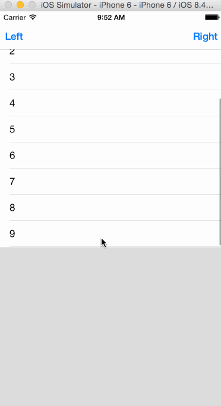

# NavDropDownMenu


方便处理从NavigationBar下弹出菜单，菜单是自己定义的view，使用方便，pod安装即可。

`pod 'NavDropDownMenu'`

使用方法：

```
- (void)showMenu{
    self.dropDownMenu.menuContentView = self.menu.view;
    [self.dropDownMenu showInView:self.view withFrame:CGRectMake(0, 64, self.view.frame.size.width, self.view.frame.size.height*0.5)];
}

- (NavDropDownMenu*)dropDownMenu{
    if(!_dropDownMenu){
        _dropDownMenu = [[NavDropDownMenu alloc] init];
    }
    return _dropDownMenu;
}

- (MenuTableViewController*)menu{
    if(!_menu){
        _menu = [[MenuTableViewController alloc] init];
    }
    return _menu;
}
```


